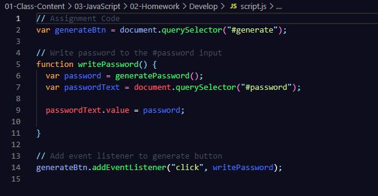
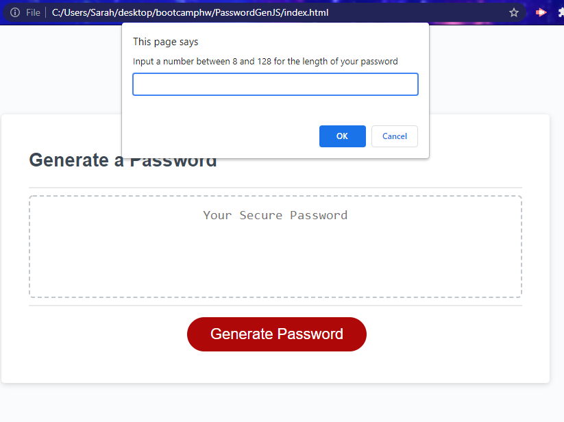

# PasswordGenJS
In this program, my goal was to create a password generator using javascript  
that would generate a random password that satisfied certain user inputs and selections.

We were given this javascript code to start with (and all the html and css we needed as well).

I began by creating four different arrays for the different character options (upper case alpha, lower case alpha, numbers, and symbols), though I actually created these as strings and then used split to seperate each item into distinct elements.

In the given function "generatePassword", I began by asking the user (using the window prompt) to provide a length numerically for their desired password. 

I then created an if statement that checked that the number was from 8 to 128 (inclusive) and actually an integer. If all these conditions were true, the user would be taken through a set of window confirm prompts to select which arrays to add to their choices for a random password. I used if statements to establish when the program would concatenate the array, and if the result was false, it would just move to the next statement.

After the array was established, I used a while loop to allow the program to iterate through selecting a random element of the password element array and then add it (using .push) to a new array. The loop was set to run until the counter was greater than the user provided password length.

When the while loop was finished, I joined the array into a string and set the function to return that string as the password.

To test the program yourself, please go to the following url: <https://segarrison.github.io/PasswordGenJS/> 
